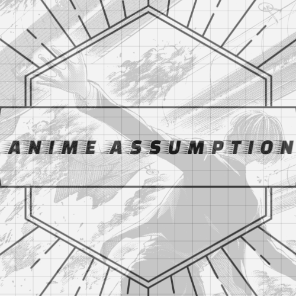

# Anime Assumption (v 0.1.0)

This is the repository of my CS 455 Project where I pursue the latest hit craze,
Wordle and put my own twist on it.

Initial plan for this application is having users guess the title of different Anime Titles 
similarly to Wordle. I chose six letters of length as there was more titles to work with there,
and eventually I wanted to add different days, with different lengths, to accomodate longer titles.

## About This Application
This app is a simple recreation of wordle with a twist, and has minimal features.

This is the current roadmap.
- [x] UI 
- [x] Entry Field
- [x] Field to show Guesses and which letters are correct
- [ ] Accurate guessing fields with feedback
- [ ] Word Archive Menu
- [ ] Hint Feature

## Table of Contents

1. Manifest
2. Installation Instructions
3. Usage
4. Contact Information
5. Demo Pictures
6. Bug List 
7. License
8. Project Status
9. Credits and Acknowledgements 
## Manifest
- README.md ---------> Readme file containing documentation
- App.js ----------------> File with majority of the code
- Assets ----------------> Image folder for readme
## Installation Instructions
- Clone the application
git clone https://github.com/wlam97/CS-455

- install via npm
npm install

- run via preferred method

one can attach their device and use for emulation, or use a web emulator.
## Usage

Usage of the application plays out very similarly to Wordle itself, however there are
some features that will be added in the future for more functionality.

Currently, the application will begin by displaying the length of the word one will be guessing,
and the amount of tries a user gets. 

They will enter their guess into the provided entry field, by tapping on this field the 
keyboard will come up and a user can begin typing their guess.

After the user has used up all of their guesses, they have lost the game.
If a user manages to guess the word, they will have won the game for that specific day.
## Demo
Included below is my Project logo, and the main UI of my application.

## Bug List

- Game does not accurately track guesses and letter guesses
    - (In the works of being implemented but with the due date looming closer, I was worried about errors)
## Contact Information

You can contact me, [Wilson Lam](mailto:wlam9779@gmail.com)
for any inquiries
## Copyright Information, License

This project/application is under the MIT License

## Project Status

- The project is still currently being worked on, and will be properly finished sooner or later as wordle is something I enjoy, and adding my own twist to it could be exciting for my friends or family to try even.
## Credits and Acknowledgements

- The internet, as there have been many guides released lately, with respect to codeacademy, reactnativeschool, and youtubers notJust.dev & youraveragetechbro
- The original Wordle game for inspiration
- Trevor, for his informative lectures to me and my other fellow zoomies
